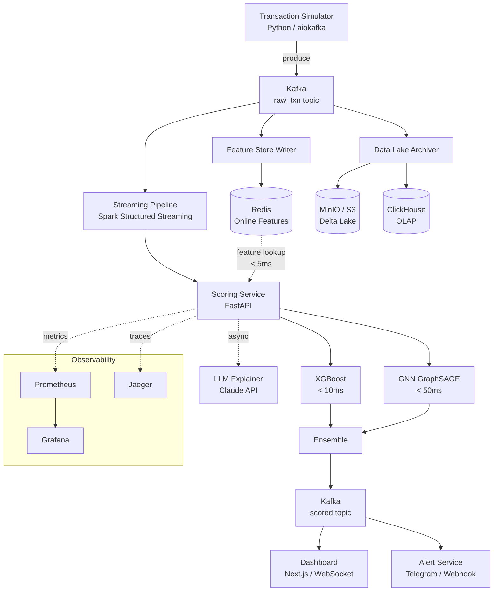

# Fraud Detection Platform

[](https://github.com/mara-werils/fraud-detection-platform/actions/workflows/ci.yml)
[](https://www.python.org/downloads/)
[](LICENSE)
[](docker-compose.yml)

Real-time ML-powered fraud detection platform that scores financial transactions in under 100 ms using an ensemble of XGBoost, Graph Neural Network, and LLM explainer.

## Architecture



## Features

- **Real-time scoring** — End-to-end transaction scoring in < 100 ms (p95)
- **ML ensemble** — XGBoost (tabular) + GraphSAGE GNN (fraud ring detection) with weighted combination
- **LLM explanations** — Human-readable fraud decision explanations via Claude API (async, non-blocking)
- **Feature store** — Dual-layer: Redis for real-time features (< 5 ms), ClickHouse for offline analytics
- **Streaming pipeline** — Spark Structured Streaming with windowed aggregations (1m, 5m, 1h, 24h)
- **Live dashboard** — Next.js 14 with WebSocket feed, fraud map, score distribution charts, and model comparison
- **A/B testing** — Hash-based user split for comparing model versions with statistical significance tracking
- **Alerting** — Configurable fraud alerts via Telegram, webhook, and email with deduplication
- **Data lake** — Delta Lake on MinIO with Parquet archival and dbt transforms
- **Full observability** — Prometheus metrics, Grafana dashboards, Jaeger distributed tracing
- **GitOps deployment** — Kubernetes manifests, Terraform IaC, ArgoCD with automated sync

## Tech Stack

| Category | Technology | Purpose |
|----------|-----------|---------|
| **ML / AI** | XGBoost, PyTorch Geometric, Optuna, SHAP | Model training, GNN, hyperparameter tuning, interpretability |
| **LLM** | Claude API, Ollama | Decision explanations |
| **Streaming** | Apache Kafka, Spark Structured Streaming | Event streaming, real-time enrichment |
| **Storage** | ClickHouse, Redis 7, MinIO (S3), Delta Lake | OLAP, online features, object storage, ACID lake |
| **Backend** | FastAPI, aiokafka, Pydantic | API, async Kafka, validation |
| **Frontend** | Next.js 14, TypeScript, Tailwind, Recharts, Leaflet | Real-time dashboard |
| **Data Transforms** | dbt, Apache Airflow, Great Expectations | SQL transforms, orchestration, data quality |
| **MLOps** | MLflow | Experiment tracking, model registry |
| **Infrastructure** | Docker, Kubernetes, Terraform, ArgoCD | Containers, orchestration, IaC, GitOps |
| **CI/CD** | GitHub Actions | Lint, test, build, deploy |
| **Monitoring** | Prometheus, Grafana, Jaeger | Metrics, dashboards, distributed tracing |

## Quick Start

### Prerequisites

- Docker and Docker Compose v2
- Python 3.11+ (for local development)
- Make

### Run

```bash
# Clone the repository
git clone https://github.com/mara-werils/fraud-detection-platform.git
cd fraud-detection-platform

# Configure environment
cp .env.example .env

# Start all services
make up

# Visit the dashboard
open http://localhost:3000
```

The platform will start generating simulated transactions, scoring them through the ML pipeline, and displaying results on the dashboard.

### Verify

```bash
# Check service health
curl http://localhost:8000/health

# Score a transaction
curl -X POST http://localhost:8000/score \
  -H "Content-Type: application/json" \
  -d '{
    "txn_id": "test-001",
    "user_id": "user-001",
    "merchant_id": "merch-001",
    "amount": 45000.00,
    "currency": "KZT",
    "category": "electronics",
    "channel": "mobile_app",
    "timestamp": "2026-05-10T14:23:01Z"
  }'
```

## Project Structure

```
fraud-detection-platform/
├── simulator/              # Transaction simulator (Kafka producer, 5 fraud patterns)
├── scoring/                # ML scoring service (FastAPI, XGBoost, GNN, ensemble)
├── feature_store/          # Feature store (Redis online + ClickHouse offline)
├── streaming/              # Spark Structured Streaming (enrichment, windowed aggregates)
├── alert_service/          # Alerting (Telegram, webhook, email)
├── dashboard/              # Next.js 14 real-time UI (WebSocket, charts, maps)
├── data_lake/              # Archiver (MinIO/Delta Lake), dbt transforms, ClickHouse DDL
├── ml_pipeline/            # Training pipeline (XGBoost, GNN, Optuna, MLflow)
├── orchestration/          # Airflow DAGs (retrain, backfill, dbt, data quality)
├── infra/                  # Terraform, Kubernetes manifests, ArgoCD
├── observability/          # Prometheus, Grafana, Jaeger configuration
├── load_tests/             # k6 load tests (scoring endpoint, E2E pipeline)
├── scripts/                # Data seeding, dataset generation, migrations
├── shared/                 # Shared library (config, logging, schemas)
├── docs/                   # Architecture, data model, ML models, runbook, ADRs
├── docker-compose.yml      # Application services
├── docker-compose.infra.yml # Infrastructure (Kafka, Redis, ClickHouse, MinIO)
├── Makefile                # Developer commands
└── pyproject.toml          # Python dependencies (monorepo)
```

## API Documentation

The scoring service exposes an OpenAPI-documented REST API at `http://localhost:8000/docs`.

### Key Endpoints

| Method | Path | Description |
|--------|------|-------------|
| `POST` | `/score` | Score a transaction and return fraud probability + decision |
| `GET` | `/health` | Service health check with model loading status |
| `GET` | `/model/info` | Current model versions, A/B test configuration |
| `GET` | `/metrics` | Prometheus metrics (latency, throughput, scores) |

### Scoring Response

```json
{
  "txn_id": "550e8400-...",
  "fraud_score": 0.87,
  "xgboost_score": 0.82,
  "gnn_score": 0.91,
  "decision": "BLOCK",
  "explanation": "Unusual high-value transaction from new device...",
  "latency_ms": 47,
  "model_version": "v2.3.1",
  "ab_group": "challenger"
}
```

## ML Models

The platform uses a three-model ensemble:

| Model | Role | Latency | Key Strength |
|-------|------|---------|-------------|
| **XGBoost** | Primary scorer | < 10 ms | Tabular features, fast inference |
| **GraphSAGE GNN** | Graph analysis | < 50 ms | Fraud ring and network detection |
| **LLM Explainer** | Decision explanation | Async | Human-readable justifications |

The ensemble combines scores with configurable weights (default: 60% XGBoost + 30% GNN + 10% rules) and applies decision thresholds: **BLOCK** (>= 0.80), **REVIEW** (0.50–0.79), **ALLOW** (< 0.50).

For detailed model cards, training processes, and evaluation metrics, see [docs/ml_models.md](docs/ml_models.md).

## Performance

### Latency Targets

| Metric | Target | Notes |
|--------|--------|-------|
| Scoring p50 | < 30 ms | Typical transaction |
| Scoring p95 | < 100 ms | Including feature retrieval |
| Scoring p99 | < 200 ms | Worst case |
| E2E pipeline p99 | < 500 ms | Kafka → score → alert |
| Feature retrieval | < 5 ms | Redis pipeline get |

### Throughput

| Scenario | Target |
|----------|--------|
| Scoring endpoint | 10,000 RPS |
| E2E pipeline | 5,000 txn/sec |
| Spike handling | 0 → 50,000 RPS in 30s |

Load tests are in `load_tests/` — run with:
```bash
k6 run load_tests/k6_scoring.js
k6 run load_tests/k6_e2e.js
```

## Monitoring

### Grafana Dashboards

- **System Health** — CPU, memory, pod count, error rate across all services
- **Fraud Overview** — Live fraud rate, blocked amounts, score distribution, geographic heatmap
- **Model Performance** — AUC-ROC over time, A/B test comparison, feature importance
- **Kafka Overview** — Throughput, consumer lag, partition balance

### Prometheus Alerts

| Alert | Condition | Severity |
|-------|-----------|----------|
| High scoring latency | p99 > 100 ms for 5 min | Warning |
| Kafka consumer lag | Lag > 10,000 for 5 min | Warning |
| High fraud rate | Fraud rate > 5% over 5 min | Critical |
| Model drift detected | AUC drop > 5% over 24h | Warning |
| Service down | Health check fails for 1 min | Critical |

Access Grafana at `http://localhost:3001` (default credentials: `admin` / `admin`).

## Development

### Make Commands

```bash
make up          # Start all services
make down        # Stop and remove containers
make up-infra    # Start infrastructure only (Kafka, Redis, ClickHouse, MinIO)
make test        # Run test suite with coverage
make lint        # Run ruff + mypy
make format      # Auto-format with ruff
make simulate    # Start transaction simulator
make logs        # Tail all service logs
make clean       # Remove caches and artifacts
```

### Testing

```bash
# Unit and integration tests
make test

# Load tests
k6 run load_tests/k6_scoring.js
k6 run load_tests/k6_e2e.js

# Lint and type check
make lint
```

### Model Training

```bash
# Train XGBoost model
python -m ml_pipeline.train_xgboost

# Train GNN model
python -m ml_pipeline.train_gnn

# Hyperparameter search
python -m ml_pipeline.hyperopt_search

# Evaluate models
python -m ml_pipeline.evaluate
```

## Architecture Decision Records

- [ADR-001: Kafka over RabbitMQ](docs/adr/001-kafka-over-rabbitmq.md) — Why Kafka for event streaming
- [ADR-002: ClickHouse for OLAP](docs/adr/002-clickhouse-for-olap.md) — Why ClickHouse over PostgreSQL
- [ADR-003: GNN for Graph Fraud](docs/adr/003-gnn-for-graph-fraud.md) — Why GraphSAGE for fraud ring detection

## License

This project is licensed under the MIT License. See [LICENSE](LICENSE) for details.
