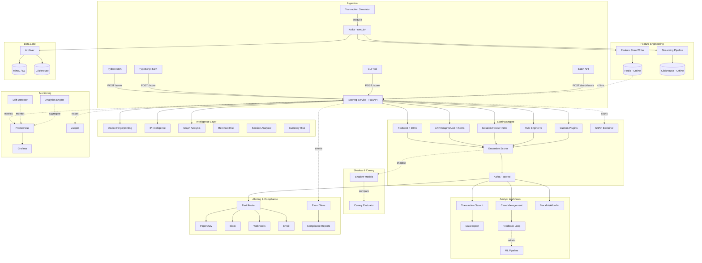

<p align="center">
  
</p>

<h1 align="center">Fraud Detection Platform</h1>

<p align="center">
  <strong>Open-source, real-time fraud detection platform with ML ensemble scoring, graph analysis, device fingerprinting, and analyst workflows.</strong>
</p>

<p align="center">
  <a href="https://github.com/mara-werils/fraud-detection-platform/actions/workflows/ci.yml"></a>
  <a href="https://www.python.org/downloads/"></a>
  <a href="LICENSE"></a>
  <a href="docker-compose.yml"></a>
  <a href="https://github.com/mara-werils/fraud-detection-platform/stargazers"></a>
</p>

<p align="center">
  <a href="#quick-start">Quick Start</a> &bull;
  <a href="#features">Features</a> &bull;
  <a href="#architecture">Architecture</a> &bull;
  <a href="docs/architecture.md">Docs</a> &bull;
  <a href="#sdks">SDKs</a> &bull;
  <a href="CONTRIBUTING.md">Contributing</a>
</p>

---

## Why This Platform?

Most fraud detection tools force you to choose: **rules OR machine learning**, **library OR platform**, **Python OR production-ready**. This is the first open-source project that combines **all of these** into a single, deployable system — from transaction ingestion to analyst case resolution.

> **One `docker compose up` and you have a full fraud detection stack** — ML models scoring transactions in real-time, a streaming pipeline enriching features, a dashboard showing live fraud patterns, and an API your team can integrate today.

### Comparison with Existing Solutions

| Feature | **This Platform** | Marble | Jube | PyOD | Feast + BentoML |
|---------|:-:|:-:|:-:|:-:|:-:|
| Real-time ML scoring (< 100ms) | :white_check_mark: | :x: | Partial | :x: | Manual |
| Rule engine (YAML, hot-reload) | :white_check_mark: | :white_check_mark: | :white_check_mark: | :x: | :x: |
| ML ensemble (XGBoost + GNN) | :white_check_mark: | :x: | Partial | Library | Manual |
| Anomaly detection (Isolation Forest) | :white_check_mark: | :x: | :x: | :white_check_mark: | :x: |
| Graph fraud ring detection | :white_check_mark: | :x: | :x: | :x: | :x: |
| Device fingerprinting | :white_check_mark: | :x: | :x: | :x: | :x: |
| IP intelligence (VPN/Tor/proxy) | :white_check_mark: | :x: | :x: | :x: | :x: |
| Built-in feature store | :white_check_mark: | :x: | :x: | :x: | Feast only |
| Case management | :white_check_mark: | :white_check_mark: | :white_check_mark: | :x: | :x: |
| Python + TypeScript SDKs | :white_check_mark: | :x: | :x: | Python | Separate |
| Plugin system (custom scorers) | :white_check_mark: | :x: | :x: | :x: | :x: |
| Shadow mode / canary deployment | :white_check_mark: | :x: | :x: | :x: | :x: |
| A/B testing with statistics | :white_check_mark: | :x: | :x: | :x: | :x: |
| Drift detection | :white_check_mark: | :x: | :x: | :x: | :x: |
| SHAP explainability | :white_check_mark: | :x: | :x: | :x: | :x: |
| Blocklist/allowlist management | :white_check_mark: | :white_check_mark: | :white_check_mark: | :x: | :x: |
| Sanctions screening (AML) | :white_check_mark: | :x: | :white_check_mark: | :x: | :x: |
| Compliance reporting (PCI-DSS) | :white_check_mark: | :x: | :x: | :x: | :x: |
| Event sourcing audit trail | :white_check_mark: | :x: | :x: | :x: | :x: |
| Multi-currency risk scoring | :white_check_mark: | :x: | :x: | :x: | :x: |
| Chaos engineering framework | :white_check_mark: | :x: | :x: | :x: | :x: |
| Docker Compose one-command start | :white_check_mark: | Partial | Partial | N/A | :x: |
| Full observability (metrics, traces) | :white_check_mark: | :x: | :x: | :x: | :x: |

## Features

### Core Scoring Engine
- **Sub-100ms scoring** — End-to-end transaction scoring with p95 < 100ms
- **ML ensemble** — XGBoost (tabular) + GraphSAGE GNN (fraud rings) + Isolation Forest (anomaly) with weighted combination and graceful degradation
- **YAML rule engine v2** — 20+ built-in rules, hot-reloadable, nested AND/OR/NOT conditions, 12 operators
- **Batch scoring** — Score thousands of transactions in a single API call
- **SHAP explainability** — Per-transaction feature importance with natural language explanations
- **Plugin system** — Extend with custom scorers via Python plugins with hot-reload

### Intelligence Layer
- **Device fingerprinting** — Browser/device risk scoring, device sharing detection, spoofing indicators
- **IP intelligence** — VPN/Tor/proxy detection, geo-distance analysis, ASN classification, IP velocity
- **Graph network analysis** — Fraud ring detection via community detection, PageRank, and bipartite analysis
- **Merchant risk profiling** — Per-merchant fraud rates, category risk, anomaly detection
- **Session analysis** — Cross-session linking, concurrent session detection, velocity checks
- **Multi-currency risk** — FATF jurisdiction risk, structuring detection, round-tripping

### Analyst Workflows
- **Case management** — Create, assign, investigate, and resolve fraud cases with full audit trail
- **Feedback loop** — Analyst decisions feed back into model retraining
- **Blocklist/allowlist** — Dynamic entity lists (user, device, IP, merchant, card, email)
- **Transaction search** — Filter and query scored transactions by any field
- **Data export** — Export transactions and cases in CSV/JSON for compliance reporting

### ML Operations
- **Shadow mode** — Run new models alongside production without affecting decisions
- **Canary deployment** — Gradual traffic shifting with automatic promote/rollback
- **A/B testing** — Statistical significance testing with automatic winner detection
- **Model drift detection** — Automated PSI/KS monitoring with alerting
- **Anomaly detection** — Isolation Forest with online learning and adaptive thresholds
- **Model registry** — MLflow integration with experiment tracking and versioning

### Compliance & Security
- **Compliance reporting** — Automated PCI-DSS, SOX, GDPR, and AML/KYC checks
- **Event sourcing** — Immutable audit trail with 16 event types and replay capability
- **GDPR compliance** — Right to erasure, data portability, and configurable retention
- **Sanctions screening** — PEP/sanctions list checking integration
- **Alert routing** — Rule-based routing with escalation policies and PagerDuty/Slack/email

### Platform
- **Python SDK** — `pip install fraud-detection-sdk` for easy integration
- **TypeScript SDK** — `npm install @fraud-detection/sdk` for JS/Node.js apps
- **CLI tool** — `fraud-cli` for platform management from the terminal
- **API versioning** — v1/v2 with deprecation headers and version negotiation
- **Webhook delivery** — Reliable delivery with exponential backoff, HMAC signing, dead-letter queue
- **Real-time analytics** — Dashboard metrics, time-series, geo heatmaps, pattern detection

### Infrastructure
- **Feature store** — Dual-layer: Redis (online, < 5ms) + ClickHouse (offline analytics)
- **Streaming pipeline** — Kafka-based with windowed aggregations (1m, 5m, 1h, 24h)
- **Live dashboard** — Next.js 14 with WebSocket feed, fraud map, and score distribution
- **Alerting** — Multi-channel (Telegram, PagerDuty, Slack, webhook, email) with deduplication
- **Data lake** — Delta Lake on MinIO with dbt transforms
- **Full observability** — Prometheus, Grafana dashboards, Jaeger tracing
- **Database migrations** — Alembic with versioned schema management
- **GitOps** — Kubernetes + Terraform + ArgoCD
- **Chaos engineering** — Built-in resilience testing framework

## Architecture



## Quick Start

### Prerequisites

- Docker and Docker Compose v2
- Python 3.11+ (for local development)
- Make

### Run

```bash
# Clone the repository
git clone https://github.com/mara-werils/fraud-detection-platform.git
cd fraud-detection-platform

# Configure environment
cp .env.example .env

# Start all services (infrastructure + application)
make up

# Visit the dashboard
open http://localhost:3000
```

The platform starts generating simulated transactions, scoring them through the ML pipeline, and displaying results on the dashboard.

### Verify

```bash
# Health check
curl http://localhost:8000/health

# Score a single transaction
curl -X POST http://localhost:8000/api/v1/score \
  -H "Content-Type: application/json" \
  -H "X-API-Key: your-api-key" \
  -d '{
    "transaction_id": "550e8400-e29b-41d4-a716-446655440000",
    "user_id": "12345678-1234-5678-1234-567812345678",
    "amount": 45000.00,
    "currency": "USD",
    "transaction_type": "purchase",
    "merchant_id": "merch-001",
    "merchant_category": "electronics",
    "device_id": "device-abc123",
    "ip_address": "203.0.113.42",
    "timestamp": "2026-05-10T14:23:01Z"
  }'
```

### Generate Synthetic Data

```bash
# Generate 50K transactions with realistic fraud patterns
make generate-data

# Or customize
python scripts/generate_synthetic_data.py \
  --num-users 5000 \
  --num-merchants 500 \
  --num-transactions 100000 \
  --fraud-rate 0.03 \
  --output-format parquet \
  --output-path data/training/
```

## SDKs

### Python

```bash
pip install fraud-detection-sdk
```

```python
from fraud_sdk import FraudClient

client = FraudClient(
    base_url="http://localhost:8000",
    api_key="your-api-key",
)

# Score a transaction
result = client.score(
    user_id="user-001",
    amount=45000.00,
    currency="USD",
    merchant_id="merch-001",
    category="electronics",
)

print(f"Score: {result.fraud_score}, Decision: {result.decision}")

# Batch score
results = client.batch_score(transactions=[...])

# Search high-risk transactions
txns = client.search_transactions(min_score=0.7, limit=10)
```

### TypeScript / Node.js

```bash
npm install @fraud-detection/sdk
```

```typescript
import { FraudClient } from '@fraud-detection/sdk';

const client = new FraudClient({
  baseUrl: 'http://localhost:8000',
  apiKey: 'your-api-key',
});

// Score a transaction
const result = await client.score({
  userId: 'user-001',
  amount: 45000.00,
  currency: 'USD',
  merchantId: 'merch-001',
});

console.log(`Score: ${result.fraudScore}, Decision: ${result.decision}`);

// Batch score
const results = await client.batchScore(transactions);

// Get analytics dashboard
const dashboard = await client.getDashboardMetrics();
```

## Project Structure

```
fraud-detection-platform/
├── scoring/                    # ML scoring service (FastAPI)
│   ├── api/                    # Routes, middleware, auth, versioning
│   ├── models/                 # XGBoost, GNN, Isolation Forest, rules engine
│   ├── plugins/                # Plugin system for custom scorers
│   ├── services/               # 20+ services (see below)
│   └── tests/                  # 100+ tests
├── feature_store/              # Feature store (Redis + ClickHouse)
├── streaming/                  # Streaming pipeline (Kafka)
├── alert_service/              # Multi-channel alerting
├── dashboard/                  # Next.js 14 real-time UI
├── sdks/
│   └── typescript/             # TypeScript SDK
├── sdk/                        # Python SDK
├── cli/                        # CLI tool
├── ml_pipeline/                # Training pipeline (XGBoost, GNN, Optuna, MLflow)
├── orchestration/              # Airflow DAGs
├── data_lake/                  # Delta Lake archiver, dbt transforms
├── migrations/                 # Alembic database migrations
├── scripts/                    # Data generation, seeding
├── tests/
│   └── chaos/                  # Chaos engineering framework
├── shared/                     # Shared schemas, logging, Kafka utils
├── infra/                      # Terraform, Kubernetes, ArgoCD
├── observability/              # Prometheus, Grafana, Jaeger
├── load_tests/                 # k6 load tests
├── docs/                       # Architecture, data model, ML models
├── docker-compose.yml          # Application services
└── docker-compose.infra.yml    # Infrastructure
```

### Scoring Services (`scoring/services/`)

| Service | Description |
|---------|-------------|
| `analytics_engine` | Real-time metrics, time-series, geographic heatmaps |
| `alert_routing` | Rule-based alert routing with escalation policies |
| `case_manager` | Fraud case lifecycle management |
| `compliance` | PCI-DSS, SOX, GDPR, AML/KYC compliance checks |
| `currency_risk` | Multi-currency risk, structuring, round-tripping |
| `device_fingerprint` | Device risk scoring and anomaly detection |
| `drift_detector` | Model drift monitoring (PSI/KS) |
| `entity_lists` | Blocklist/allowlist/watchlist management |
| `event_store` | Event sourcing with immutable audit trail |
| `explainability` | SHAP-based feature importance and explanations |
| `feedback_store` | Analyst feedback for model retraining |
| `graph_analysis` | Fraud ring detection, PageRank, communities |
| `ip_intelligence` | VPN/Tor/proxy detection, geo-risk, ASN analysis |
| `merchant_risk` | Merchant profiling and category risk |
| `session_analyzer` | Session linking, velocity checks, concurrency |
| `shadow_mode` | Shadow model execution and canary deployment |
| `transaction_store` | Scored transaction storage and search |
| `webhook_delivery` | Reliable delivery with backoff and dead letters |
| `websocket_hub` | Real-time WebSocket feed for dashboard |

## Tech Stack

| Category | Technology | Purpose |
|----------|-----------|---------|
| **ML / AI** | XGBoost, PyTorch Geometric, Isolation Forest, SHAP | Ensemble scoring, GNN, anomaly detection, explainability |
| **LLM** | Claude API, Ollama | Decision explanations |
| **Streaming** | Apache Kafka | Event streaming, real-time enrichment |
| **Storage** | PostgreSQL, ClickHouse, Redis 7, MinIO (S3) | OLTP, OLAP, online features, object storage |
| **Backend** | FastAPI, aiokafka, Pydantic v2 | API, async messaging, validation |
| **Frontend** | Next.js 14, TypeScript, Tailwind, Recharts | Real-time dashboard |
| **Data** | dbt, Apache Airflow, Alembic | Transforms, orchestration, migrations |
| **MLOps** | MLflow, Optuna | Experiment tracking, hyperparameter tuning |
| **Infra** | Docker, Kubernetes, Terraform, ArgoCD | Containers, orchestration, IaC, GitOps |
| **Monitoring** | Prometheus, Grafana, Jaeger | Metrics, dashboards, tracing |
| **Testing** | pytest, k6, chaos engineering | Unit/integration, load, resilience |

## API Documentation

Full OpenAPI docs available at `http://localhost:8000/docs` when running locally.

### Key Endpoints

| Method | Path | Description |
|--------|------|-------------|
| `POST` | `/api/v1/score` | Score a single transaction |
| `POST` | `/api/v1/batch/score` | Batch score multiple transactions |
| `GET` | `/api/v1/transactions` | Search scored transactions |
| `POST` | `/api/v1/transactions/export` | Export transactions (CSV/JSON) |
| `GET` | `/api/v1/cases` | List fraud cases |
| `POST` | `/api/v1/cases` | Create a fraud case |
| `PATCH` | `/api/v1/cases/{id}` | Update case status |
| `POST` | `/api/v1/feedback` | Submit analyst feedback |
| `GET` | `/api/v1/drift/report` | Model drift report |
| `GET` | `/api/v1/analytics/dashboard` | Real-time dashboard metrics |
| `GET` | `/api/v1/analytics/timeseries/{metric}` | Time-series data |
| `GET` | `/api/v1/model/info` | Model version and stats |
| `GET` | `/api/v1/model/features` | Feature importance (SHAP) |
| `GET` | `/api/v1/ab/results` | A/B test results |
| `POST` | `/api/v1/lists/entries` | Add to blocklist/allowlist |
| `POST` | `/api/v1/lists/check` | Check entity against lists |
| `POST` | `/api/v1/sanctions/check` | Check against sanctions lists |
| `GET` | `/api/v1/compliance/report/{standard}` | Compliance report |
| `POST` | `/api/v1/webhooks` | Register a webhook |
| `GET` | `/health` | Service health check |
| `GET` | `/metrics` | Prometheus metrics |

### Scoring Response

```json
{
  "transaction_id": "550e8400-e29b-41d4-a716-446655440000",
  "fraud_score": 0.87,
  "decision": "BLOCK",
  "model_scores": {
    "xgboost": 0.82,
    "gnn": 0.91,
    "isolation_forest": 0.78,
    "rules": 0.65
  },
  "explanation": "This transaction was flagged primarily because the amount ($9,999) is 15x higher than the user's average ($650), it originated from a new device, and the location is 1,200km from the user's last transaction.",
  "feature_importance": {
    "amount_zscore": 0.34,
    "is_new_device": 0.28,
    "distance_from_last_txn_km": 0.19,
    "txn_count_1h": 0.12,
    "unique_countries_24h": 0.07
  },
  "risk_signals": {
    "device_risk": 0.72,
    "ip_risk": 0.45,
    "merchant_risk": 0.30,
    "currency_risk": 0.15
  },
  "latency_ms": 47,
  "model_version": "ensemble-v2.3.1"
}
```

## ML Models

| Model | Role | Latency | Key Strength |
|-------|------|---------|-------------|
| **XGBoost** | Primary scorer | < 10 ms | Tabular features, fast inference |
| **GraphSAGE GNN** | Graph analysis | < 50 ms | Fraud ring and network detection |
| **Isolation Forest** | Anomaly detection | < 5 ms | Unsupervised, online learning |
| **Rule Engine v2** | Configurable rules | < 1 ms | Deterministic, YAML, hot-reload |
| **Custom Plugins** | Extensible | Variable | Domain-specific scoring |
| **LLM Explainer** | Explanation | Async | Human-readable justifications |

Ensemble weights: 50% XGBoost + 25% GNN + 15% Isolation Forest + 10% Rules (configurable). Decision thresholds: **BLOCK** (>= 0.80), **REVIEW** (0.50-0.79), **ALLOW** (< 0.50).

See [docs/ml_models.md](docs/ml_models.md) for model cards, training, and evaluation.

## Fraud Detection Capabilities

### 8 Built-in Fraud Pattern Detectors

| Pattern | Detection Method | Description |
|---------|-----------------|-------------|
| **Card Testing** | Velocity rules | Rapid small transactions to test stolen cards |
| **Account Takeover** | Device + IP + behavior | Sudden change in device, location, spending |
| **Friendly Fraud** | Behavioral analysis | Legitimate-looking transactions later disputed |
| **Synthetic Identity** | Graph analysis | Mixed real/fake identity elements |
| **Bust-Out** | Temporal patterns | Build trust, then large fraudulent activity |
| **Money Laundering** | Structuring detection | Amounts just below reporting thresholds |
| **Merchant Collusion** | Merchant risk scoring | Merchants with abnormally high fraud rates |
| **CNP Fraud** | Multi-signal ensemble | Card-not-present with stolen credentials |

## Performance

| Metric | Target |
|--------|--------|
| Scoring p50 | < 30 ms |
| Scoring p95 | < 100 ms |
| Scoring p99 | < 200 ms |
| E2E pipeline p99 | < 500 ms |
| Feature retrieval | < 5 ms |
| Scoring throughput | 10,000 RPS |
| Batch scoring | 5,000 txn/batch |

Run benchmarks:
```bash
make benchmark          # Scoring endpoint
make benchmark-e2e      # End-to-end pipeline
make benchmark-scale    # 100K user scale test
```

## Development

```bash
make up              # Start all services
make down            # Stop all services
make up-infra        # Start infrastructure only
make test            # Run all tests with coverage
make test-unit       # Run unit tests only
make test-integration # Run integration tests only
make lint            # Ruff + mypy
make format          # Auto-format
make simulate        # Start transaction simulator
make generate-data   # Generate synthetic training data
make migrate         # Run database migrations
make benchmark       # Run load tests
make logs            # Tail service logs
make clean           # Remove caches
```

## Architecture Decision Records

- [ADR-001: Kafka over RabbitMQ](docs/adr/001-kafka-over-rabbitmq.md)
- [ADR-002: ClickHouse for OLAP](docs/adr/002-clickhouse-for-olap.md)
- [ADR-003: GNN for Graph Fraud](docs/adr/003-gnn-for-graph-fraud.md)

## Contributing

We welcome contributions! See [CONTRIBUTING.md](CONTRIBUTING.md) for guidelines.

## Security

Please report security vulnerabilities responsibly. See [SECURITY.md](SECURITY.md) for details.

## License

This project is licensed under the MIT License. See [LICENSE](LICENSE) for details.
