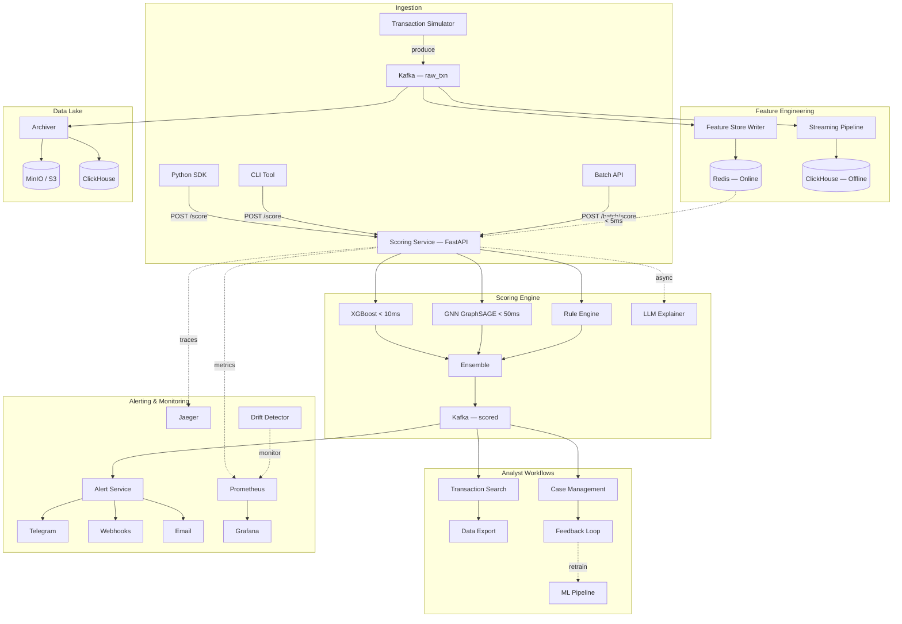

<p align="center">
  
</p>

<h1 align="center">Fraud Detection Platform</h1>

<p align="center">
  <strong>The open-source, real-time fraud detection platform with ML ensemble scoring, case management, and analyst workflows — all in one.</strong>
</p>

<p align="center">
  <a href="https://github.com/mara-werils/fraud-detection-platform/actions/workflows/ci.yml"></a>
  <a href="https://www.python.org/downloads/"></a>
  <a href="LICENSE"></a>
  <a href="docker-compose.yml"></a>
  <a href="https://github.com/mara-werils/fraud-detection-platform/stargazers"></a>
</p>

<p align="center">
  <a href="#quick-start">Quick Start</a> &bull;
  <a href="#features">Features</a> &bull;
  <a href="#architecture">Architecture</a> &bull;
  <a href="docs/architecture.md">Docs</a> &bull;
  <a href="#python-sdk">SDK</a> &bull;
  <a href="CONTRIBUTING.md">Contributing</a>
</p>

---

## Why This Platform?

Most fraud detection tools force you to choose: **rules OR machine learning**, **library OR platform**, **Python OR production-ready**. This platform is the first open-source project that combines all of these into a single, deployable system.

### Comparison with Existing Solutions

| Feature | **This Platform** | Marble | Jube | PyOD | Feast + BentoML |
|---------|:-:|:-:|:-:|:-:|:-:|
| Real-time ML scoring (< 100ms) | **Yes** | No | Partial | No | Manual |
| Rule engine | **Yes** | Yes | Yes | No | No |
| ML ensemble (XGBoost + GNN) | **Yes** | No | Partial | Library only | Manual |
| Built-in feature store | **Yes** | No | No | No | Feast only |
| Case management | **Yes** | Yes | Yes | No | No |
| Python SDK | **Yes** | No | No | Yes | Separate |
| Streaming pipeline | **Yes** | No | No | No | No |
| Batch scoring API | **Yes** | No | Yes | No | Manual |
| A/B testing with statistics | **Yes** | No | No | No | No |
| Drift detection | **Yes** | No | No | No | No |
| Feedback loop | **Yes** | No | Partial | No | No |
| Sanctions screening | **Yes** | No | Yes | No | No |
| Docker Compose one-command start | **Yes** | Partial | Partial | N/A | No |
| Dashboard & analytics | **Yes** | Yes | Partial | No | No |
| Full observability (metrics, traces) | **Yes** | No | No | No | No |
| Language | **Python** | Go | .NET | Python | Python |

## Features

### Core Scoring Engine
- **Sub-100ms scoring** — End-to-end transaction scoring with p95 < 100ms
- **ML ensemble** — XGBoost (tabular) + GraphSAGE GNN (fraud rings) with weighted combination and graceful degradation
- **Configurable rule engine** — YAML-based rules, hot-reloadable without restarts
- **Batch scoring** — Score thousands of transactions in a single API call
- **LLM explanations** — Human-readable fraud decision explanations via Claude API (async)

### Analyst Workflows
- **Case management** — Create, assign, investigate, and resolve fraud cases with full audit trail
- **Feedback loop** — Analyst decisions feed back into model retraining
- **Transaction search** — Filter and query scored transactions by any field
- **Data export** — Export transactions and cases in CSV/JSON for compliance reporting

### ML Operations
- **A/B testing** — Statistical significance testing with automatic winner detection
- **Model drift detection** — Automated PSI/KS monitoring with alerting
- **Feature importance** — Real-time SHAP-based explainability per transaction
- **Model registry** — MLflow integration for experiment tracking and model versioning

### Platform
- **Python SDK** — `pip install fraud-detection-sdk` for easy integration
- **CLI tool** — `fraud-cli` for platform management from the terminal
- **API authentication** — API key-based auth with rate limiting
- **Webhook management** — Configure alert destinations via API
- **Sanctions screening** — PEP/sanctions list checking integration
- **Circuit breakers** — Resilient service communication with automatic fallbacks

### Infrastructure
- **Feature store** — Dual-layer: Redis (online, < 5ms) + ClickHouse (offline analytics)
- **Streaming pipeline** — Kafka-based with windowed aggregations (1m, 5m, 1h, 24h)
- **Live dashboard** — Next.js 14 with WebSocket feed, fraud map, and score distribution
- **Alerting** — Multi-channel (Telegram, webhook, email) with deduplication
- **Data lake** — Delta Lake on MinIO with dbt transforms
- **Full observability** — Prometheus, Grafana dashboards, Jaeger tracing
- **GitOps** — Kubernetes + Terraform + ArgoCD

## Architecture



## Quick Start

### Prerequisites

- Docker and Docker Compose v2
- Python 3.11+ (for local development)
- Make

### Run

```bash
# Clone the repository
git clone https://github.com/mara-werils/fraud-detection-platform.git
cd fraud-detection-platform

# Configure environment
cp .env.example .env

# Start all services (infrastructure + application)
make up

# Visit the dashboard
open http://localhost:3000
```

The platform starts generating simulated transactions, scoring them through the ML pipeline, and displaying results on the dashboard.

### Verify

```bash
# Health check
curl http://localhost:8000/health

# Score a single transaction
curl -X POST http://localhost:8000/api/v1/score \
  -H "Content-Type: application/json" \
  -H "X-API-Key: your-api-key" \
  -d '{
    "txn_id": "test-001",
    "user_id": "user-001",
    "merchant_id": "merch-001",
    "amount": 45000.00,
    "currency": "KZT",
    "category": "electronics",
    "channel": "mobile_app",
    "timestamp": "2026-05-10T14:23:01Z"
  }'

# Batch score
curl -X POST http://localhost:8000/api/v1/batch/score \
  -H "Content-Type: application/json" \
  -H "X-API-Key: your-api-key" \
  -d '{"transactions": [...]}'

# Search transactions
curl "http://localhost:8000/api/v1/transactions?min_score=0.7&limit=10" \
  -H "X-API-Key: your-api-key"
```

## Python SDK

```bash
pip install fraud-detection-sdk
```

```python
from fraud_sdk import FraudClient

client = FraudClient(
    base_url="http://localhost:8000",
    api_key="your-api-key",
)

# Score a transaction
result = client.score(
    user_id="user-001",
    amount=45000.00,
    currency="KZT",
    merchant_id="merch-001",
    category="electronics",
)

print(f"Score: {result.fraud_score}, Decision: {result.decision}")

# Batch score
results = client.batch_score(transactions=[...])

# Search transactions
txns = client.search_transactions(min_score=0.7, limit=10)
```

## Project Structure

```
fraud-detection-platform/
├── scoring/                # ML scoring service (FastAPI, ensemble, rule engine)
│   ├── api/                # Routes, middleware, auth, rate limiting
│   ├── models/             # XGBoost, GNN, ensemble, rule engine
│   └── services/           # Case management, drift detection, search
├── feature_store/          # Feature store (Redis online + ClickHouse offline)
├── streaming/              # Streaming pipeline (Kafka, windowed aggregates)
├── alert_service/          # Multi-channel alerting (Telegram, webhook, email)
├── dashboard/              # Next.js 14 real-time UI
├── sdk/                    # Python SDK client library
├── cli/                    # CLI tool for platform management
├── ml_pipeline/            # Training pipeline (XGBoost, GNN, Optuna, MLflow)
├── orchestration/          # Airflow DAGs
├── data_lake/              # Delta Lake archiver, dbt transforms
├── shared/                 # Shared schemas, logging, Kafka utils
├── infra/                  # Terraform, Kubernetes, ArgoCD
├── observability/          # Prometheus, Grafana, Jaeger configs
├── load_tests/             # k6 load tests
├── docs/                   # Architecture, data model, ML models, runbook
├── docker-compose.yml      # Application services
└── docker-compose.infra.yml # Infrastructure
```

## Tech Stack

| Category | Technology | Purpose |
|----------|-----------|---------|
| **ML / AI** | XGBoost, PyTorch Geometric, Optuna, SHAP | Model training, GNN, tuning, interpretability |
| **LLM** | Claude API, Ollama | Decision explanations |
| **Streaming** | Apache Kafka | Event streaming, real-time enrichment |
| **Storage** | ClickHouse, Redis 7, MinIO (S3), Delta Lake | OLAP, online features, object storage |
| **Backend** | FastAPI, aiokafka, Pydantic v2 | API, async messaging, validation |
| **Frontend** | Next.js 14, TypeScript, Tailwind, Recharts | Real-time dashboard |
| **Data** | dbt, Apache Airflow, Great Expectations | Transforms, orchestration, quality |
| **MLOps** | MLflow | Experiment tracking, model registry |
| **Infra** | Docker, Kubernetes, Terraform, ArgoCD | Containers, orchestration, IaC, GitOps |
| **Monitoring** | Prometheus, Grafana, Jaeger | Metrics, dashboards, tracing |

## API Documentation

Full OpenAPI docs available at `http://localhost:8000/docs` when running locally.

### Key Endpoints

| Method | Path | Description |
|--------|------|-------------|
| `POST` | `/api/v1/score` | Score a single transaction |
| `POST` | `/api/v1/batch/score` | Batch score multiple transactions |
| `GET` | `/api/v1/transactions` | Search scored transactions |
| `POST` | `/api/v1/transactions/export` | Export transactions (CSV/JSON) |
| `GET` | `/api/v1/cases` | List fraud cases |
| `POST` | `/api/v1/cases` | Create a fraud case |
| `PATCH` | `/api/v1/cases/{id}` | Update case status |
| `POST` | `/api/v1/feedback` | Submit analyst feedback |
| `GET` | `/api/v1/drift/report` | Model drift report |
| `GET` | `/api/v1/model/info` | Model version and stats |
| `GET` | `/api/v1/model/features` | Feature importance |
| `GET` | `/api/v1/ab/results` | A/B test results with statistics |
| `GET` | `/api/v1/webhooks` | List configured webhooks |
| `POST` | `/api/v1/webhooks` | Register a webhook |
| `POST` | `/api/v1/sanctions/check` | Check against sanctions lists |
| `GET` | `/health` | Service health check |
| `GET` | `/metrics` | Prometheus metrics |

### Scoring Response

```json
{
  "txn_id": "550e8400-...",
  "fraud_score": 0.87,
  "decision": "BLOCK",
  "model_scores": {
    "xgboost": 0.82,
    "gnn": 0.91,
    "rules": 0.65
  },
  "explanation": "Unusual high-value transaction from new device...",
  "feature_importance": {
    "amount_zscore": 0.34,
    "is_new_device": 0.28,
    "distance_from_last_txn_km": 0.19
  },
  "latency_ms": 47,
  "model_version": "ensemble-v2.3.1",
  "ab_group": "challenger"
}
```

## ML Models

| Model | Role | Latency | Key Strength |
|-------|------|---------|-------------|
| **XGBoost** | Primary scorer | < 10 ms | Tabular features, fast inference |
| **GraphSAGE GNN** | Graph analysis | < 50 ms | Fraud ring and network detection |
| **Rule Engine** | Configurable rules | < 1 ms | Deterministic checks, YAML config |
| **LLM Explainer** | Decision explanation | Async | Human-readable justifications |

Ensemble weights: 60% XGBoost + 30% GNN + 10% Rules (configurable). Decision thresholds: **BLOCK** (>= 0.80), **REVIEW** (0.50-0.79), **ALLOW** (< 0.50).

See [docs/ml_models.md](docs/ml_models.md) for model cards, training, and evaluation.

## Performance

| Metric | Target |
|--------|--------|
| Scoring p50 | < 30 ms |
| Scoring p95 | < 100 ms |
| Scoring p99 | < 200 ms |
| E2E pipeline p99 | < 500 ms |
| Feature retrieval | < 5 ms |
| Scoring throughput | 10,000 RPS |
| Batch scoring | 5,000 txn/batch |

Run benchmarks:
```bash
k6 run load_tests/k6_scoring.js
k6 run load_tests/k6_e2e.js
```

## Monitoring

Access Grafana at `http://localhost:3001` (default: `admin`/`admin`).

| Dashboard | What it shows |
|-----------|--------------|
| **System Health** | CPU, memory, pod count, error rate |
| **Fraud Overview** | Live fraud rate, blocked amounts, score distribution |
| **Model Performance** | AUC-ROC, A/B comparison, drift metrics |
| **Kafka Overview** | Throughput, consumer lag, partition balance |

## Development

```bash
make up           # Start all services
make down         # Stop all services
make up-infra     # Start infrastructure only
make test         # Run tests with coverage
make lint         # Ruff + mypy
make format       # Auto-format
make simulate     # Start transaction simulator
make logs         # Tail service logs
make clean        # Remove caches
```

## Architecture Decision Records

- [ADR-001: Kafka over RabbitMQ](docs/adr/001-kafka-over-rabbitmq.md)
- [ADR-002: ClickHouse for OLAP](docs/adr/002-clickhouse-for-olap.md)
- [ADR-003: GNN for Graph Fraud](docs/adr/003-gnn-for-graph-fraud.md)

## Contributing

We welcome contributions! See [CONTRIBUTING.md](CONTRIBUTING.md) for guidelines.

## Security

Please report security vulnerabilities responsibly. See [SECURITY.md](SECURITY.md) for details.

## License

This project is licensed under the MIT License. See [LICENSE](LICENSE) for details.
