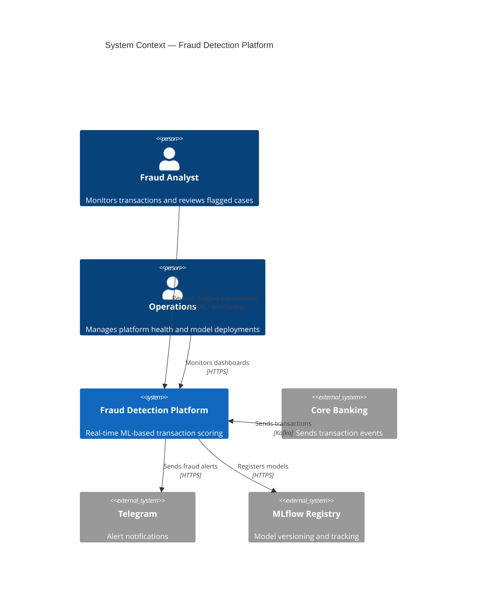
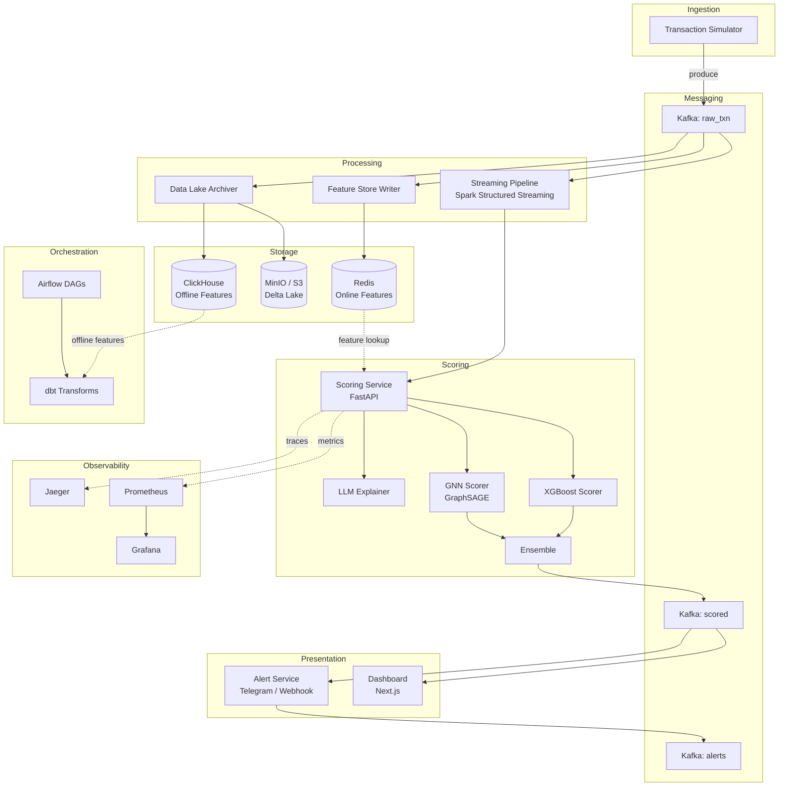
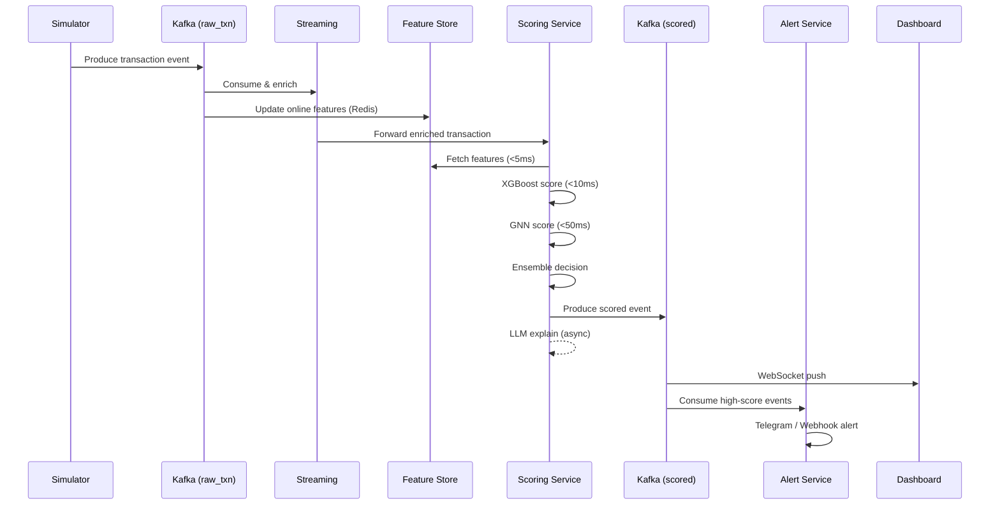
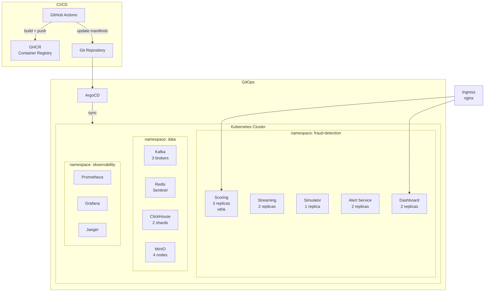

# Architecture

## System Overview

The Fraud Detection Platform is a real-time, event-driven microservices system that processes financial transactions, enriches them with features, scores them through an ML ensemble (XGBoost + GNN + LLM explainer), and delivers decisions in under 100 ms.

## Component Architecture

## Component Descriptions

| # | Service | Technology | Responsibility |
|---|---------|-----------|----------------|
| 1 | **Transaction Simulator** | Python, aiokafka | Generates realistic transaction events with configurable fraud patterns (card testing, account takeover, geo anomaly, velocity abuse, merchant collusion). Produces to `raw_txn` Kafka topic. |
| 2 | **Streaming Pipeline** | Spark Structured Streaming | Consumes raw transactions, computes windowed aggregations (1m, 5m, 1h, 24h), enriches with IP geolocation and device fingerprinting. Outputs enriched events for scoring. |
| 3 | **Feature Store** | Redis (online) + ClickHouse (offline) | Online store provides sub-5ms feature retrieval for real-time scoring. Offline store supports batch feature engineering and model training. Feature registry tracks versions. |
| 4 | **Scoring Service** | FastAPI, XGBoost, PyTorch Geometric | Core service. Fetches features, runs ML ensemble (XGBoost + GNN), applies decision logic (ALLOW / REVIEW / BLOCK), produces scored events. Supports A/B testing. |
| 5 | **Alert Service** | Python, aiokafka | Consumes scored events above threshold, sends notifications via Telegram, webhook, and email. Supports deduplication and batching. |
| 6 | **Dashboard** | Next.js 14, TypeScript, Tailwind | Real-time fraud monitoring UI with live transaction feed (WebSocket), fraud map, score distribution charts, model comparison, and analytics. |
| 7 | **Data Lake** | MinIO (S3), Delta Lake, dbt | Archives transactions to Parquet/Delta format. dbt transforms raw data into staging, intermediate, and mart layers for analytics and retraining. |

## Data Flow

### Transaction Lifecycle

### Latency Budget

| Stage | Target | Notes |
|-------|--------|-------|
| Kafka produce → consume | < 5 ms | Single-partition, local broker |
| Feature retrieval (Redis) | < 5 ms | Pipeline get, connection pool |
| XGBoost inference | < 10 ms | Pre-loaded model, numpy arrays |
| GNN inference | < 50 ms | Cached embeddings, batch updates |
| Ensemble + decision | < 2 ms | Weighted average |
| Kafka produce (scored) | < 5 ms | Async, non-blocking |
| **Total (p95)** | **< 100 ms** | |
| LLM explanation (async) | 500–2000 ms | Does not block scoring path |

## Technology Choices

| Category | Technology | Rationale |
|----------|-----------|-----------|
| Message Broker | Apache Kafka | High throughput, durable, replay capability. See [ADR-001](adr/001-kafka-over-rabbitmq.md). |
| Online Store | Redis 7 | Sub-millisecond reads, native data structures (sorted sets, hashes). |
| OLAP Database | ClickHouse | Column-oriented, fast aggregations on billions of rows. See [ADR-002](adr/002-clickhouse-for-olap.md). |
| Object Storage | MinIO (S3-compatible) | Delta Lake support, cost-effective long-term storage. |
| ML Framework | XGBoost + PyTorch Geometric | XGBoost for tabular speed; GNN for graph-based fraud ring detection. See [ADR-003](adr/003-gnn-for-graph-fraud.md). |
| API Framework | FastAPI | Async-native, auto-generated OpenAPI docs, Pydantic validation. |
| Frontend | Next.js 14 | React-based SSR, excellent TypeScript support, built-in routing. |
| Orchestration | Apache Airflow | Industry-standard DAG orchestration for batch pipelines. |
| Data Transforms | dbt | SQL-based transforms, testing, documentation, lineage. |
| Experiment Tracking | MLflow | Model registry, experiment comparison, artifact storage. |
| Container Orchestration | Kubernetes | Auto-scaling, self-healing, declarative infrastructure. |
| IaC | Terraform | Multi-cloud support, modular, state management. |
| GitOps | ArgoCD | Automated sync from Git to K8s, rollback support. |
| CI/CD | GitHub Actions | Native integration, matrix builds, reusable workflows. |
| Monitoring | Prometheus + Grafana | Pull-based metrics, rich dashboarding, alerting. |
| Tracing | Jaeger (OpenTelemetry) | Distributed trace visualization, root cause analysis. |

## Deployment Architecture

## Scalability Considerations

- **Scoring Service**: Horizontal Pod Autoscaler scales from 3 to 20 replicas based on CPU utilization (> 70%) and p99 latency (> 100 ms). Stateless design enables linear scaling.
- **Kafka**: 3-broker cluster with configurable partitions per topic. Consumer groups enable parallel processing. Partition count can be increased without downtime.
- **Feature Store (Redis)**: Redis Sentinel for HA. Read replicas for scaling reads. Pipeline batching reduces round trips.
- **ClickHouse**: MergeTree engine with monthly partitions. Horizontal sharding for write-heavy workloads. Materialized views for pre-computed aggregations.
- **Data Lake**: MinIO with erasure coding for durability. Delta Lake enables ACID transactions and time travel on object storage.
- **Dashboard**: Server-side rendering with CDN caching. WebSocket connections load-balanced across replicas.
