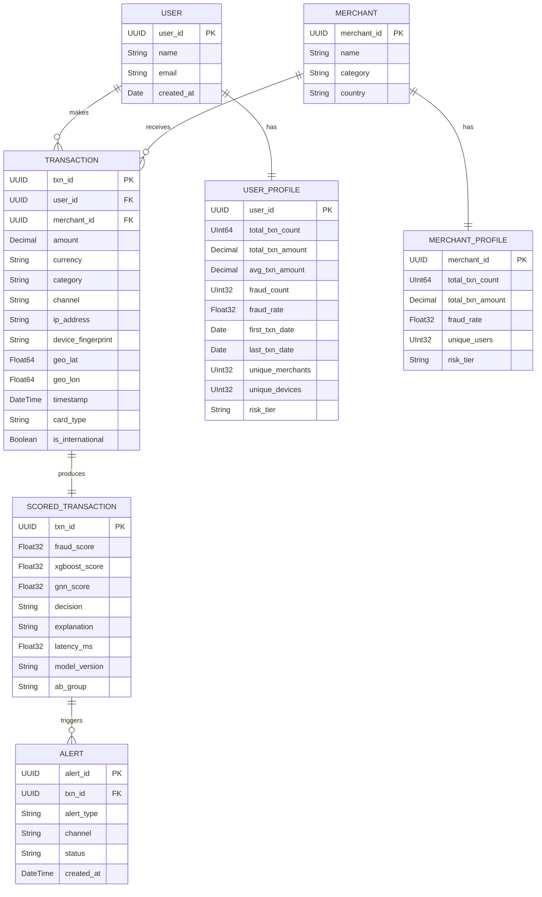
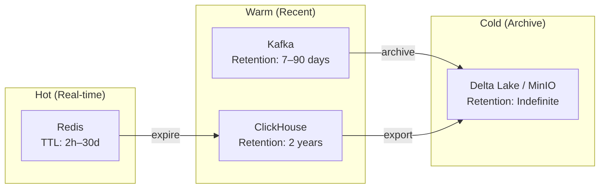

# Data Model

## Entity-Relationship Diagram



## ClickHouse Tables

### transactions

Primary table for all processed transactions. Partitioned by month for efficient time-range queries.

```sql
CREATE TABLE fraud_detection.transactions (
    txn_id          UUID,
    user_id         UUID,
    merchant_id     UUID,
    amount          Decimal(18, 2),
    currency        LowCardinality(String),
    category        LowCardinality(String),
    channel         LowCardinality(String),
    ip_address      String,
    device_fingerprint String,
    geo_lat         Float64,
    geo_lon         Float64,
    card_type       LowCardinality(String),
    is_international UInt8,
    fraud_score     Float32,
    xgboost_score   Float32,
    gnn_score       Float32,
    decision        LowCardinality(String),  -- ALLOW | REVIEW | BLOCK
    explanation     String,
    is_fraud        UInt8,                    -- ground truth label (0/1)
    model_version   LowCardinality(String),
    ab_group        LowCardinality(String),
    latency_ms      Float32,
    created_at      DateTime64(3)
) ENGINE = MergeTree()
PARTITION BY toYYYYMM(created_at)
ORDER BY (user_id, created_at)
TTL created_at + INTERVAL 2 YEAR
SETTINGS index_granularity = 8192;
```

### user_profiles

Aggregated user-level statistics. Uses `ReplacingMergeTree` to handle upserts.

```sql
CREATE TABLE fraud_detection.user_profiles (
    user_id              UUID,
    total_txn_count      UInt64,
    total_txn_amount     Decimal(18, 2),
    avg_txn_amount       Decimal(18, 2),
    fraud_count          UInt32,
    fraud_rate           Float32,
    first_txn_date       Date,
    last_txn_date        Date,
    unique_merchants     UInt32,
    unique_devices       UInt32,
    primary_geo          String,
    risk_tier            LowCardinality(String),  -- LOW | MEDIUM | HIGH
    updated_at           DateTime64(3)
) ENGINE = ReplacingMergeTree(updated_at)
ORDER BY user_id;
```

### merchant_profiles

```sql
CREATE TABLE fraud_detection.merchant_profiles (
    merchant_id          UUID,
    name                 String,
    category             LowCardinality(String),
    country              LowCardinality(String),
    total_txn_count      UInt64,
    total_txn_amount     Decimal(18, 2),
    avg_txn_amount       Decimal(18, 2),
    fraud_count          UInt32,
    fraud_rate           Float32,
    unique_users         UInt32,
    risk_tier            LowCardinality(String),
    updated_at           DateTime64(3)
) ENGINE = ReplacingMergeTree(updated_at)
ORDER BY merchant_id;
```

### model_predictions

Audit log for model predictions, used for monitoring and retraining.

```sql
CREATE TABLE fraud_detection.model_predictions (
    txn_id          UUID,
    model_name      LowCardinality(String),
    model_version   LowCardinality(String),
    score           Float32,
    features_json   String,
    latency_ms      Float32,
    ab_group        LowCardinality(String),
    created_at      DateTime64(3)
) ENGINE = MergeTree()
PARTITION BY toYYYYMM(created_at)
ORDER BY (model_name, created_at)
TTL created_at + INTERVAL 1 YEAR;
```

## Redis Schema (Online Feature Store)

All keys use the prefix pattern `user:{user_id}:*` or `merchant:{merchant_id}:*`.

### User Features

| Key Pattern | Type | TTL | Description |
|------------|------|-----|-------------|
| `user:{id}:txn_count_1m` | String (int) | 2 min | Transaction count in last 1 minute |
| `user:{id}:txn_count_5m` | String (int) | 10 min | Transaction count in last 5 minutes |
| `user:{id}:txn_count_1h` | String (int) | 2 h | Transaction count in last 1 hour |
| `user:{id}:txn_count_24h` | String (int) | 48 h | Transaction count in last 24 hours |
| `user:{id}:txn_sum_1h` | String (float) | 2 h | Transaction sum in last 1 hour |
| `user:{id}:txn_sum_24h` | String (float) | 48 h | Transaction sum in last 24 hours |
| `user:{id}:avg_amount_30d` | String (float) | 48 h | Average transaction amount over 30 days |
| `user:{id}:max_amount_7d` | String (float) | 48 h | Maximum transaction amount in 7 days |
| `user:{id}:last_geo` | String | 48 h | Last known geolocation (`lat,lon`) |
| `user:{id}:last_txn_ts` | String (epoch) | 48 h | Timestamp of last transaction |
| `user:{id}:devices` | Set | 30 d | Set of known device fingerprints |
| `user:{id}:merchants_7d` | Set | 7 d | Set of merchants used in last 7 days |
| `user:{id}:recent_txns` | Sorted Set | 24 h | Recent transactions scored by timestamp |
| `user:{id}:gnn_embedding` | String (bytes) | 6 h | Cached GNN node embedding |

### Merchant Features

| Key Pattern | Type | TTL | Description |
|------------|------|-----|-------------|
| `merchant:{id}:txn_count_1h` | String (int) | 2 h | Transactions received in last hour |
| `merchant:{id}:fraud_rate` | String (float) | 24 h | Historical fraud rate |
| `merchant:{id}:unique_users_24h` | String (int) | 48 h | Unique users in last 24 hours |
| `merchant:{id}:category_risk` | String (float) | 24 h | Risk score for merchant category |

## Kafka Topic Schemas

### Topic: `raw_txn`

Raw transaction events produced by the simulator or upstream banking system.

- **Partitions**: 12
- **Replication factor**: 3
- **Retention**: 7 days
- **Key**: `user_id` (ensures ordering per user)

```json
{
  "txn_id": "550e8400-e29b-41d4-a716-446655440000",
  "user_id": "7c9e6679-7425-40de-944b-e07fc1f90ae7",
  "merchant_id": "f47ac10b-58cc-4372-a567-0e02b2c3d479",
  "amount": 45000.00,
  "currency": "KZT",
  "category": "electronics",
  "channel": "mobile_app",
  "ip_address": "185.23.45.67",
  "device_fingerprint": "dev_abc123def456",
  "geo_lat": 51.1694,
  "geo_lon": 71.4491,
  "timestamp": "2026-05-10T14:23:01.000Z",
  "card_type": "visa",
  "is_international": false
}
```

### Topic: `scored`

Scored transaction events after ML inference.

- **Partitions**: 12
- **Replication factor**: 3
- **Retention**: 30 days
- **Key**: `txn_id`

```json
{
  "txn_id": "550e8400-e29b-41d4-a716-446655440000",
  "user_id": "7c9e6679-7425-40de-944b-e07fc1f90ae7",
  "fraud_score": 0.87,
  "xgboost_score": 0.82,
  "gnn_score": 0.91,
  "decision": "BLOCK",
  "explanation": "Unusual high-value transaction from new device in different city, connected to known fraud cluster",
  "features_used": {
    "txn_velocity_1h": 12,
    "avg_amount_30d": 5000.0,
    "amount_deviation": 8.5,
    "new_device": true,
    "geo_distance_km": 1200.0
  },
  "latency_ms": 47,
  "model_version": "v2.3.1",
  "ab_group": "challenger",
  "timestamp": "2026-05-10T14:23:01.047Z"
}
```

### Topic: `alerts`

High-priority fraud alerts for downstream notification services.

- **Partitions**: 6
- **Replication factor**: 3
- **Retention**: 90 days
- **Key**: `user_id`

```json
{
  "alert_id": "a1b2c3d4-e5f6-7890-abcd-ef1234567890",
  "txn_id": "550e8400-e29b-41d4-a716-446655440000",
  "user_id": "7c9e6679-7425-40de-944b-e07fc1f90ae7",
  "alert_type": "HIGH_FRAUD_SCORE",
  "fraud_score": 0.87,
  "decision": "BLOCK",
  "amount": 45000.00,
  "currency": "KZT",
  "explanation": "Unusual high-value transaction from new device in different city",
  "priority": "CRITICAL",
  "created_at": "2026-05-10T14:23:01.050Z"
}
```

## Feature Vector Schema

The full feature vector passed to the ML ensemble contains 34 features across 7 categories.

### Transaction Features (5)

| # | Feature | Type | Description |
|---|---------|------|-------------|
| 1 | `amount` | float | Transaction amount (normalized) |
| 2 | `currency_encoded` | int | One-hot encoded currency |
| 3 | `category_encoded` | int | Ordinal encoded merchant category |
| 4 | `channel_encoded` | int | Ordinal encoded channel |
| 5 | `is_international` | bool | Cross-border transaction flag |

### Velocity Features (6)

| # | Feature | Type | Description |
|---|---------|------|-------------|
| 6 | `txn_count_1m` | int | Transactions in last 1 minute |
| 7 | `txn_count_5m` | int | Transactions in last 5 minutes |
| 8 | `txn_count_1h` | int | Transactions in last 1 hour |
| 9 | `txn_count_24h` | int | Transactions in last 24 hours |
| 10 | `txn_sum_1h` | float | Total amount in last 1 hour |
| 11 | `txn_sum_24h` | float | Total amount in last 24 hours |

### Amount Features (5)

| # | Feature | Type | Description |
|---|---------|------|-------------|
| 12 | `amount_deviation` | float | Std deviations from user's 30-day mean |
| 13 | `amount_to_avg_ratio` | float | `amount / avg_amount_30d` |
| 14 | `max_amount_7d` | float | Max transaction in last 7 days |
| 15 | `sum_to_max_ratio` | float | `txn_sum_1h / max_amount_7d` |
| 16 | `amount_percentile` | float | Percentile rank within user history |

### Geolocation Features (4)

| # | Feature | Type | Description |
|---|---------|------|-------------|
| 17 | `distance_from_last_txn` | float | Km from previous transaction location |
| 18 | `distance_from_home` | float | Km from user's primary location |
| 19 | `is_new_city` | bool | Transaction from a never-seen city |
| 20 | `geo_velocity` | float | `distance / time_since_last_txn` (impossible travel) |

### Device Features (4)

| # | Feature | Type | Description |
|---|---------|------|-------------|
| 21 | `is_new_device` | bool | Device not in user's known set |
| 22 | `device_age_days` | int | Days since device was first seen |
| 23 | `device_txn_count` | int | Total transactions from this device |
| 24 | `device_count_30d` | int | Unique devices used in 30 days |

### Merchant Features (4)

| # | Feature | Type | Description |
|---|---------|------|-------------|
| 25 | `is_new_merchant` | bool | First transaction with this merchant |
| 26 | `merchant_fraud_rate` | float | Historical fraud rate for merchant |
| 27 | `merchant_category_risk` | float | Risk score for merchant category |
| 28 | `merchant_txn_count_1h` | int | Merchant's transaction count in last hour |

### Temporal Features (4)

| # | Feature | Type | Description |
|---|---------|------|-------------|
| 29 | `hour_of_day` | int | 0–23, cyclically encoded |
| 30 | `day_of_week` | int | 0–6, cyclically encoded |
| 31 | `is_weekend` | bool | Saturday or Sunday |
| 32 | `is_night` | bool | Hour between 23:00 and 06:00 |

### Behavioral Features (2)

| # | Feature | Type | Description |
|---|---------|------|-------------|
| 33 | `time_since_last_txn` | float | Seconds since user's last transaction |
| 34 | `avg_time_between_txn` | float | User's average inter-transaction interval |

## Data Lifecycle and Retention



| Storage | Data | Retention | Purpose |
|---------|------|-----------|---------|
| Redis | Online features, embeddings | 2 hours – 30 days (per key TTL) | Real-time feature serving |
| Kafka | Raw transactions | 7 days | Stream replay, consumer recovery |
| Kafka | Scored transactions | 30 days | Dashboard, alert processing |
| Kafka | Alerts | 90 days | Audit trail |
| ClickHouse | All tables | 2 years | OLAP queries, model training |
| MinIO (Delta Lake) | Raw + aggregated Parquet | Indefinite | Long-term archive, compliance, model retraining |
