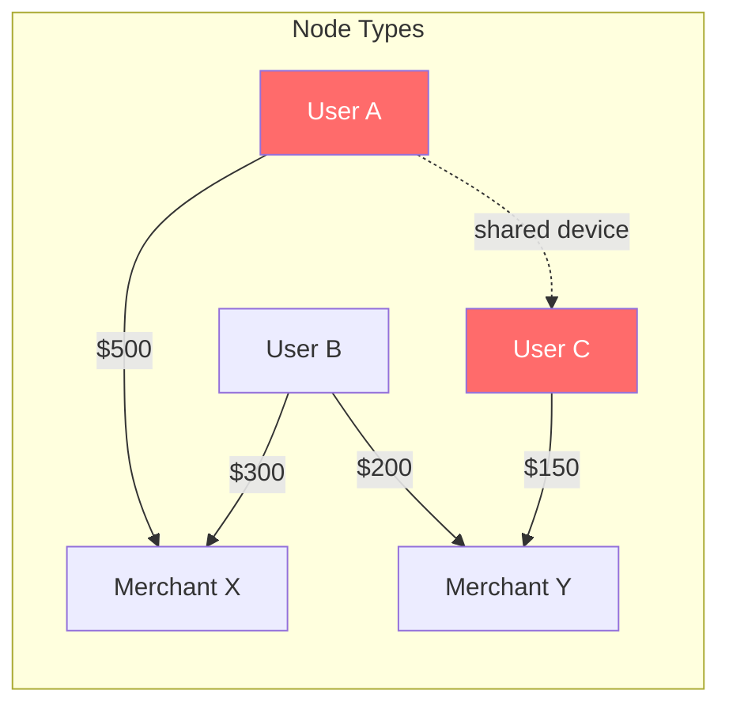

# ML Models

## Overview

The platform uses a three-model ensemble for fraud detection, each contributing a different perspective on transaction risk. An asynchronous LLM explainer generates human-readable justifications for decisions.

| Model | Role | Latency | Framework |
|-------|------|---------|-----------|
| XGBoost | Primary scorer (tabular features) | < 10 ms | XGBoost 2.x |
| GNN (GraphSAGE) | Graph-based fraud ring detection | < 50 ms | PyTorch Geometric |
| LLM Explainer | Human-readable decision explanations | 500–2000 ms (async) | Claude API / Ollama |
| Ensemble | Weighted combination of scores | < 2 ms | NumPy |

---

## Model 1: XGBoost

### Model Card

| Field | Details |
|-------|---------|
| **Task** | Binary classification (fraud vs. legitimate) |
| **Architecture** | Gradient-boosted decision trees (XGBoost) |
| **Input** | 34-feature vector (see [data_model.md](data_model.md#feature-vector-schema)) |
| **Output** | Fraud probability [0.0, 1.0] |
| **Training data** | 100K+ synthetic transactions (2% fraud rate, 5 fraud patterns) |
| **Inference latency** | < 10 ms |

### Architecture

```
Input (34 features)
    │
    ▼
┌─────────────────────┐
│  XGBoost Classifier │
│  - 500 estimators   │
│  - max_depth: 8     │
│  - learning_rate:   │
│    0.05             │
│  - subsample: 0.8   │
│  - colsample: 0.8   │
│  - scale_pos_weight │
│    (class balance)  │
└─────────┬───────────┘
          │
          ▼
   fraud_probability
       [0, 1]
```

### Features

The model uses 34 features across 7 categories: transaction attributes, velocity metrics, amount patterns, geolocation signals, device fingerprinting, merchant risk indicators, and temporal patterns. See [Feature Vector Schema](data_model.md#feature-vector-schema) for the complete list.

Top features by SHAP importance:
1. `amount_deviation` — standard deviations from the user's 30-day mean
2. `txn_count_1m` — transaction velocity in the last minute
3. `is_new_device` — first-time device flag
4. `distance_from_last_txn` — geographic displacement
5. `merchant_fraud_rate` — historical fraud rate of the merchant

### Target Metrics

| Metric | Target | Description |
|--------|--------|-------------|
| AUC-ROC | > 0.95 | Area under ROC curve |
| PR-AUC | > 0.80 | Area under Precision-Recall curve |
| Precision @ 95% Recall | > 0.80 | Precision when recall is fixed at 95% |
| F1 Score | > 0.85 | Harmonic mean of precision and recall |
| Inference latency (p99) | < 10 ms | Single-transaction scoring |

### Training Process

1. **Data preparation**: Export labeled transactions from ClickHouse / Delta Lake
2. **Feature engineering**: Compute all 34 features using the feature pipeline
3. **Class balancing**: Apply `scale_pos_weight` to handle 2% fraud rate
4. **Hyperparameter tuning**: Optuna search (200 trials) with 5-fold cross-validation
5. **Training**: XGBoost with early stopping on validation AUC
6. **Evaluation**: Compute all metrics on held-out test set (20%)
7. **Registration**: Log model, metrics, and artifacts to MLflow
8. **Promotion**: Automatic promotion if metrics improve over current production model

### Limitations

- Performance degrades on novel fraud patterns not represented in training data
- Sensitive to distribution shifts (seasonal spending patterns, new merchant categories)
- Limited ability to detect coordinated fraud rings (addressed by GNN)
- Requires periodic retraining (daily schedule via Airflow)

---

## Model 2: GNN (GraphSAGE)

### Model Card

| Field | Details |
|-------|---------|
| **Task** | Node classification on transaction graph |
| **Architecture** | GraphSAGE (2-layer, 128 hidden dim) |
| **Input** | Transaction graph (users + merchants as nodes, transactions as edges) |
| **Output** | Fraud probability per node [0.0, 1.0] |
| **Framework** | PyTorch Geometric |
| **Inference latency** | < 50 ms (cached embeddings) |

### Graph Construction



- **Nodes**: Users and merchants
- **Edges**: Transactions between users and merchants
- **Node features**: Profile attributes from `user_profiles` and `merchant_profiles`
- **Edge features**: Transaction amount, timestamp, category, frequency

### Architecture

```
Graph Input (users + merchants + transactions)
    │
    ▼
┌──────────────────────┐
│  GraphSAGE Layer 1   │
│  - Aggregator: mean  │
│  - Hidden: 128       │
│  - Activation: ReLU  │
│  - Dropout: 0.3      │
└──────────┬───────────┘
           │
           ▼
┌──────────────────────┐
│  GraphSAGE Layer 2   │
│  - Aggregator: mean  │
│  - Hidden: 128       │
│  - Activation: ReLU  │
│  - Dropout: 0.3      │
└──────────┬───────────┘
           │
           ▼
┌──────────────────────┐
│  MLP Classifier      │
│  - Linear(128, 64)   │
│  - ReLU + Dropout    │
│  - Linear(64, 1)     │
│  - Sigmoid           │
└──────────┬───────────┘
           │
           ▼
    fraud_probability
        [0, 1]
```

### Use Case: Fraud Ring Detection

The GNN excels at detecting coordinated fraud that XGBoost misses:

- **Shared device clusters**: Multiple accounts using the same device fingerprint
- **Circular money flows**: A → B → C → A patterns
- **Merchant collusion**: Unusually concentrated transaction patterns
- **Account takeover networks**: Rapid fund movement across connected accounts

### Inference Strategy

- **Batch inference**: Full graph recomputation every 5 minutes
- **Embedding cache**: Node embeddings stored in Redis (TTL: 6 hours)
- **Incremental updates**: New transactions update edge features without full recomputation
- **Fallback**: If embeddings are stale or unavailable, the ensemble relies on XGBoost alone

---

## Model 3: LLM Explainer

### Model Card

| Field | Details |
|-------|---------|
| **Task** | Generate human-readable fraud decision explanations |
| **Model** | Claude API (production) / Llama via Ollama (development) |
| **Input** | Transaction data + features + model scores |
| **Output** | Natural language explanation (1–3 sentences) |
| **Latency** | 500–2000 ms (asynchronous, non-blocking) |

### Prompt Design

```
You are a fraud detection analyst. Given the transaction data and model
scores below, provide a concise explanation (1-3 sentences) for why this
transaction was flagged as {decision}.

Transaction:
- Amount: {amount} {currency}
- Merchant: {category} ({merchant_id})
- Channel: {channel}
- Location: ({geo_lat}, {geo_lon})
- Time: {timestamp}

Risk Signals:
- Fraud Score: {fraud_score:.2f} (XGBoost: {xgboost_score:.2f}, GNN: {gnn_score:.2f})
- Amount is {amount_deviation:.1f}x the user's 30-day average
- Transaction velocity: {txn_count_1h} transactions in the last hour
- Device: {"NEW (never seen)" if is_new_device else "known"}
- Distance from last transaction: {distance_km:.0f} km
- Merchant fraud rate: {merchant_fraud_rate:.2%}

Decision: {decision}

Provide a brief, factual explanation focusing on the top risk factors.
```

### Caching Strategy

- **Similarity-based cache**: Hash key from (decision, top-3 risk signals, amount bucket)
- **Cache TTL**: 1 hour
- **Cache hit rate target**: > 60% (many transactions share similar risk profiles)
- **Storage**: Redis with LRU eviction

### Fallback

When the LLM is unavailable or exceeds the timeout threshold:

```python
TEMPLATES = {
    "BLOCK": "Transaction blocked: {reasons}",
    "REVIEW": "Transaction flagged for review: {reasons}",
    "ALLOW": "Transaction approved with monitoring: {reasons}",
}
```

Template-based explanations are generated from the top contributing features, ensuring every scored transaction has an explanation.

---

## Ensemble

### Weighting Strategy

```python
ensemble_score = (
    0.60 * xgboost_score +
    0.30 * gnn_score +
    0.10 * rule_based_score
)
```

### Decision Thresholds

| Ensemble Score | Decision | Action |
|---------------|----------|--------|
| >= 0.80 | **BLOCK** | Transaction rejected, instant alert |
| 0.50 – 0.79 | **REVIEW** | Transaction held, queued for manual review |
| < 0.50 | **ALLOW** | Transaction approved |

### Fallback Strategy

| Scenario | Behavior |
|----------|----------|
| GNN embeddings unavailable | Use XGBoost only (weight redistributed: 0.85 XGBoost + 0.15 rules) |
| Redis down (no features) | Use default feature values, increase decision thresholds by 0.1 |
| XGBoost model load failure | Fall back to rule-based scoring only |
| All models fail | Allow transaction with `decision=REVIEW`, fire critical alert |

### Calibration

Ensemble weights are calibrated weekly using a validation set:

1. Score validation transactions with each model independently
2. Optimize weights using log-loss minimization (scipy.optimize)
3. Validate that combined AUC exceeds individual models
4. Update weights in config (requires restart or hot-reload)

---

## A/B Testing

### Methodology

- **Split mechanism**: `hash(user_id) % 100`
  - Control group (0–49): Current production model
  - Challenger group (50–99): New model version
- **Minimum sample size**: 10,000 transactions per group
- **Test duration**: Minimum 7 days
- **Statistical significance**: p < 0.05 (two-tailed)

### Tracked Metrics

| Metric | Description |
|--------|-------------|
| Fraud catch rate | % of actual fraud detected |
| False positive rate | % of legitimate transactions incorrectly flagged |
| Precision @ fixed recall | Precision at 95% recall |
| AUC-ROC | Overall discriminative power |
| Latency (p50, p95, p99) | Scoring speed |
| User friction score | Proxy for customer experience impact |

### Promotion Criteria

A challenger model is promoted to production when:

1. Fraud catch rate improves by >= 2% (relative)
2. False positive rate does not increase by more than 5% (relative)
3. Latency p99 stays within SLA (< 100 ms)
4. Statistical significance achieved (p < 0.05)
5. Minimum test duration (7 days) elapsed

### Storage

- **Experiment tracking**: MLflow experiments with run tags for A/B group
- **Raw results**: ClickHouse `model_predictions` table with `ab_group` column
- **Dashboards**: Grafana panel comparing control vs. challenger metrics
